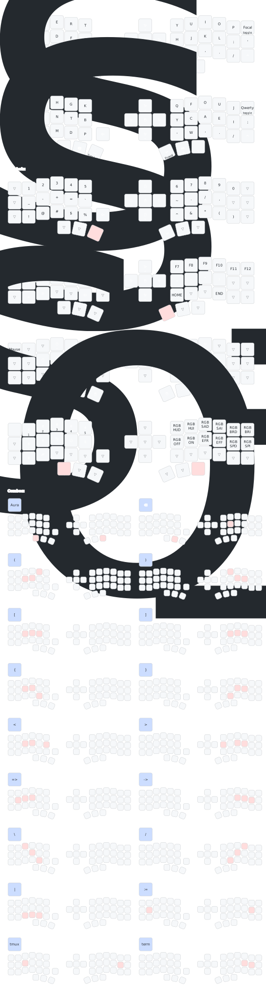

# Corne ZMK Configuration

**This keyboard is not the same as [foostan's Corne](https://github.com/foostan/crkbd). It will not work with standard `corne` firmware.**

## Setup Instructions

1. Fork this repository
2. Enable GitHub Actions in your forked repository
3. Navigate to Actions tab and enable workflows
4. Edit files manually and commit them or use [keymap editor](https://nickcoutsos.github.io/keymap-editor/)

## Keymap Diagram

